# Nhập xuất File, Unit Test trong Java

- [Nhập xuất File, Unit Test trong Java](#nhập-xuất-file-unit-test-trong-java)
  - [I. Nhập xuất File trong Java](#i-nhập-xuất-file-trong-java)
    - [1, File class trong Java là gì?](#1-file-class-trong-java-là-gì)
    - [2, Tạo Object File class](#2-tạo-object-file-class)
    - [3, Các thuộc tính, phương thức của lớp File](#3-các-thuộc-tính-phương-thức-của-lớp-file)
      - [a, Các thuộc tính](#a-các-thuộc-tính)
      - [b, Phương thức khởi tạo](#b-phương-thức-khởi-tạo)
      - [c, Các thao tác với File](#c-các-thao-tác-với-file)
        - [Tạo File/ thư mục mới](#tạo-file-thư-mục-mới)
        - [Xóa, đổi tên File/ thư mục](#xóa-đổi-tên-file-thư-mục)
        - [Đọc File](#đọc-file)
        - [Đọc dữ liệu của file vào 1 String](#đọc-dữ-liệu-của-file-vào-1-string)
        - [Ghi dữ liệu vào File](#ghi-dữ-liệu-vào-file)
        - [Thay đổi thuộc tính File](#thay-đổi-thuộc-tính-file)
        - [Kiểm tra các thuộc tính](#kiểm-tra-các-thuộc-tính)
  - [Assertion trong Java là gì](#assertion-trong-java-là-gì)
    - [1, Khai báo Assertion](#1-khai-báo-assertion)
    - [Bật tính năng assertion](#bật-tính-năng-assertion)
    - [3, Tại sao cần sử dụng Assertion](#3-tại-sao-cần-sử-dụng-assertion)
  - [Unit test](#unit-test)
    - [Unit Test trong Java](#unit-test-trong-java)

## I. Nhập xuất File trong Java
### 1, File class trong Java là gì?
File class trong Java là đại diện cho đường dẫn của một file hoặc một thư mục. Bởi vì đường dẫn hay cấu trúc file có thể khác nhau tùy thuộc vào hệ điều hành (OS) nên đường dẫn này không thể đại diện bởi một String đơn giản.

**Khác nhau giữa File path trong Windows và Linux**
||**Windows**|**Linux**|
|---|---|---|
|Phân biệt tên File|Not case sensitive|Case sensitive|
|Absolute path|Có chứa phân vùng ổ cứng|Không chứa phân vùng ổ cứng|
|Delimiter|Dấu gạch chéo ngược `\`|Dấu gạch chéo xuôi `/`|
|Ví dụ|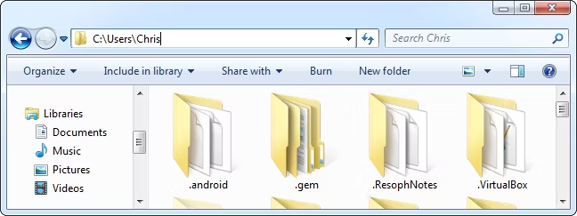|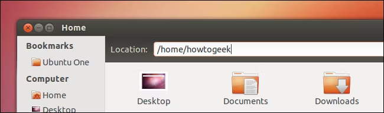|

Java File class chứa các phương thức làm việc với file và thư mục trong hệ thống như:
+ Xóa, di chuyển, đổi tên file, thư mục
+ Tạo file, thư mục mới
+ Hiển thị danh sách file
+ Đặt hoặc thay đổi các thuộc tính của file, thư mục

**Một số điểm lưu ý:**
+ File object là biểu diễn trừu tượng cho một đường dẫn nào đó trong bộ nhớ (file hoặc thư mục đó có thể không tồn tại)
+ Có thể gọi đến thư mục cha bằng phương thức getParent() bất kể đường dẫn là `absolute` hay `relative`
+ Các đối tượng của lớp File là không thể thay đổi (immutable)

### 2, Tạo Object File class
Để có thể tạo Object của lớp File, trước hết ta cần import lớp này trước:
```java
import java.io.File;
```

Cách tạo File object
>File <name> = new File(<"file path">);

Ví dụ:
```java
File a = new File("/src/name");
```

### 3, Các thuộc tính, phương thức của lớp File
Lớp File trong Java cung cấp các thuộc tính, phương thức khởi tạo, phương thức thao tác với các file trong hệ thống:

#### a, Các thuộc tính
|Thuộc tính|Kiểu DL|Mô tả|
|---|---|---|
|`pathSeperator`|String|Quy định ký tự/ chuỗi dùng để phân chia các phần trong đường dẫn|
|`pathSeperatorChar`|Char|Quy định ký tự phân chia path|
|`separator`|String|String separator mặc định|
|`separatorChar`|Char|Char separator mặc định|

#### b, Phương thức khởi tạo
+ `File(File parent, String child)`
+ `File(String pathname)`
+ `File(String parent, String child)`
+ `File(URI uri)`
<!--Thêm ví dụ-->

**Ví dụ**
```java
import java.io.IOException;
import java.io.File;

class Main {
    public static void main(String args[]) throws IOException
    {
        File a = new File("D:\\");
        String name = "Test.txt";
        File b = new File(a, name);
        String path = "D:\\abc\\Test.txt";
        File c = new File(path);
        System.out.println(b.getPath());
        System.out.println(c.getPath());
    }
}
```
**Output**
>D:\Test.txt
D:\abc\Test.txt

#### c, Các thao tác với File
##### Tạo File/ thư mục mới
Có 2 cách để tạo File mới trong Java:
+ Dùng phương thức `createNewFile()`
+ Dùng `fileOutputStream`

Để tạo thư mục mới ta dùng phương thức `mkdir()`.

*Ví dụ 1*
```java
import java.io.IOException;
import java.io.File;

class Main {
    public static void main(String args[]) throws IOException
    {
        String path = "D:\\abc";
        String name = "Test.txt";
        File c = new File(path);
        c.mkdir();
        File d = new File(c, name);
        d.createNewFile();
    }
}
```
Chương trình trên sau khi chạy sẽ tạo ra folder rỗng `abc` sau đó thêm file rỗng `Test.txt` ở trong địa chỉ `D:`.

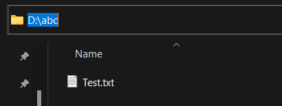

*Ví dụ 2*
```java
import java.io.IOException;
import java.io.FileOutputStream;

class Main {
    public static void main(String args[]) throws IOException
    {
        String path = "D:";
        String name = "Test.txt";
        FileOutputStream a = new FileOutputStream(path + "\\" + name);
    }
}
```

##### Xóa, đổi tên File/ thư mục
Để xóa một file hoặc thư mục, ta dùng phương thức `delete()`.
```java
import java.io.IOException;
import java.io.File;

class Main {
    public static void main(String args[]) throws IOException
    {
        String path = "D:\\abc";
        String name = "Test.txt";
        File c = new File(path);
        File d = new File(c, name);
        d.delete();
        c.delete();
    }
}
```
Để đổi tên file/ thư mục, ta dùng phương thức `renameTo(File file)` kiểu `boolean`.
```java
import java.io.IOException;
import java.io.File;

class Main {
    public static void main(String args[]) throws IOException
    {
        String path1 = "D:\\def";
        String path2 = "D:\\abc";
        File a = new File(path1);
        File b = new File(path2);
        boolean bool = a.renameTo(b);
        System.out.println("Is rename done: " + bool);
        String oldName = "Test.txt";
        String newName = "TestDone.txt";
        a = new File(path2, oldName);
        b = new File(path2, newName);
        bool = a.renameTo(b);
        System.out.println("Is rename done: " + bool);
    }
}
```
*Output*
>Is rename done: true
Is rename done: true

Chương trình trên đổi tên file `Test.txt` ở trong folder `def` thành file `TestDone.txt` ở trong folder `abc`.  
Trong trường hợp không tồn tại file cần rename hoặc tên file đích đã có ở trong folder thì rename thất bại và biến `bool` có giá trị là `false`.

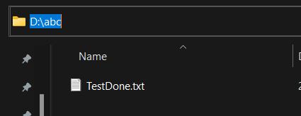


##### Đọc File
Có 3 cách để đọc dữ liệu từ một text file:
+ BufferedReader
  `BufferedReader name = new BufferedReader(Reader in, \<int size>)`
+ FileReader
  + `FileReader fr = new FileReader(File file)`
  + `FileReader(FileDescriptor fd)`
  + `FileReader(String fileName)`
+ Scanner
  + `Scanner sc = new Scanner(File file)`

*Ví dụ 1*
```java
import java.io.*;

public class Main {
    public static void main(String[] args) throws Exception
    {
        File file = new File("C:\\Users\\pankaj\\Desktop\\test.txt");
        BufferedReader br = new BufferedReader(new FileReader(file));
        String st;
        while ((st = br.readLine()) != null)
            System.out.println(st);
    }
}
```

*Ví dụ 2*
```java
import java.io.*;

public class Main {
    public static void main(String[] args) throws Exception
    {
        FileReader fr = new FileReader("C:\\Users\\pankaj\\Desktop\\test.txt");
        int i;
        while ((i = fr.read()) != -1)
            System.out.print((char)i);
    }
}
```

*Ví dụ 3*
```java
import java.io.File;
import java.util.Scanner;
public class Main {
    public static void main(String[] args) throws Exception
    {
        File file = new File("C:\\Users\\pankaj\\Desktop\\test.txt");
        Scanner sc = new Scanner(file);

        while (sc.hasNextLine())
            System.out.println(sc.nextLine());
    }
}
```

##### Đọc dữ liệu của file vào 1 String
```java
import java.nio.file.*;

public class Main{
    public static String readFileAsString(String fileName)
            throws Exception
    {
        String data = "";
        data = new String(Files.readAllBytes(Paths.get(fileName)));
        return data;
    }

    public static void main(String[] args) throws Exception
    {
        String data = readFileAsString("C:\\Users\\pankaj\\Desktop\\test.java");
        System.out.println(data);
    }
}
```

##### Ghi dữ liệu vào File
Có 4 cách để ghi dữ liệu vào file trong Java:
+ Dùng phương thức writeString()
  Phương thức này được hỗ trợ từ Java 11. Phương thức này có 4 tham số bao gồm: `file path`, `character sequence`(ký tự cần in), và 2 thuộc tính bổ sung là `charset` và `option`.
+ Dùng lớp FileWriter
  `FileWriter fw = new FileWriter("path");`  
  `FileWriter fw = new FileWriter(File file);`
+ Dùng lớp BufferedWriter
  `BufferedWriter bw = new BufferedWriter(new FileWriter(FileWriter fw, \<int size>);`
+ Dùng lớp FileOutputStream
  `FileOutputStream fos = new FileOutputStream(File file)`  
  `FileOutputStream fos = new FileOutputStream(String path)`

*Ví dụ 1*
```java
import java.io.IOException;
import java.nio.file.Files;
import java.nio.file.Path;

public class Main {
    public static void main(String[] args) throws IOException
    {
        String text = "Bao tiền một mớ tình duyên\nHỏi em em bảo có năm trăm cành";
        Path fileName = Path.of("D:\\abc\\def\\Test.txt");
        
        // Writing into the file
        Files.writeString(fileName, text);

        // Reading the content of the file
        String file_content = Files.readString(fileName);

        // Printing the content inside the file
        System.out.println(file_content);
    }
}

```

*Ví dụ 2*
```java
import java.io.FileWriter;
import java.io.IOException;

public class Main{
    public static void main(String[] args)
    {
        String text = "Hello World!";

        try {
            FileWriter fWriter = new FileWriter("D:\\abc\\def\\Test.txt");
            
            fWriter.write(text);

            System.out.println(text);

            fWriter.close();

            System.out.println(
                    "File is created successfully with the content.");
        }

        catch (IOException e) {
            System.out.print(e.getMessage());
        }
    }
}

```

*Ví dụ 3*
```java

```

*Ví dụ 4*
```java

```

##### Thay đổi thuộc tính File

##### Kiểm tra các thuộc tính 


## Assertion trong Java là gì
Assertion trong Java là những giả định được Lập trình viên tạo ra để kiểm tra tính đúng đắn của một số điều kiện nào đó, thường được sử dụng nhằm mục đích kiểm thử chương trình.

Assertion luôn được giả định là đúng. Nếu sai, chương trình sẽ trả lỗi `AssertionError`.
<!--Thêm ví dụ-->
```java

```

### 1, Khai báo Assertion
Có 2 cách để tạo Assertion trong Java:
1. `Assert expression;`
2. `Assert expression : "message";`

**Ví dụ**
```java
import java.util.Scanner;

public class Main{
    public static void main(String[] args){
        Scanner sc = new Scanner(System.in);
        int x = sc.nextInt();
        String gender = sc.next();
        assert gender.equals("Nam") && x >= 20 || gender.equals("Nu") && x >= 19 : "Anh chị chưa đủ tuổi kết hôn";
        System.out.println("Anh chị đã đủ tuổi kết hôn");
    }
}
```
Assertion trong chương trình trên dùng để kiểm tra một người liệu có đủ tuổi kết hôn hay không.

|Input|Output|
|---|---|
|19</br>Nam|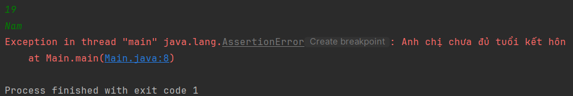|
|18</br>Nu|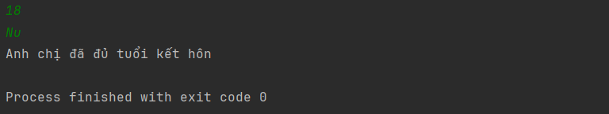|

Trong trường hợp biểu thức trong assertion sai mà chương trình không ném lỗi thì đó là do tính năng này đang bị vô hiệu hóa.

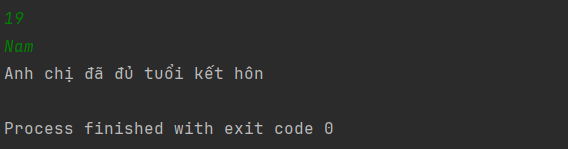

### Bật tính năng assertion
Để có thể sử dụng assertion trong Java. Ta có thể bật tính năng này bằng 2 cách.

**Cách 1: chạy trên terminal**
Gọi bất kỳ terminal nào, trỏ đến thư mục chứa file java cần chạy, sau đó chạy file bằng câu lệnh:
>java -ea Main.java

Với Main.java là tên file.
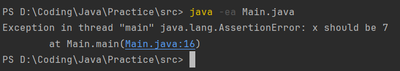

**Cách 2: Enable assertion trong IDE**
+ Bước 1: Bấm vào nút 3 chấm, dưới mục `Configuration` chọn `Edit`.
  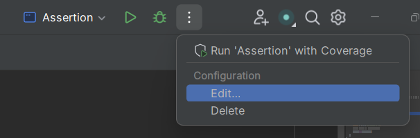
+ Bước 2: Tìm mục `modify options` chọn `add VM options`.
  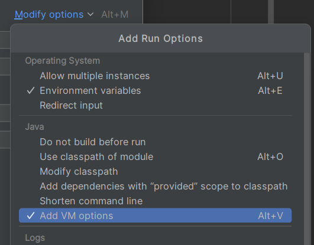
+ Bước 3: Trong `VM options` gõ `-ea`.
  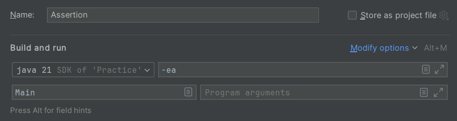

### 3, Tại sao cần sử dụng Assertion
Assertion được sử dụng bất kỳ khi nào kỹ sư phần mềm muốn kiểm tra tính đúng sai của một vấn đề trong lập trình Java.
+ Để đảm bảo rằng một mã không thể truy cập thực sự không thể truy cập được
+ Để đảm bảo rằng các giá trị giả định được viết trong các nhận xét là đúng
+ Để đảm bảo rằng trường hợp chuyển đổi mặc định không được thực thi
+ Kiểm tra trạng thái của đối tượng
+ Sử dụng tại điểm, bắt đầu của phương thức

## Unit test
Unit Test có nghĩa là kiểm thử đơn vị, một bước trong kiểm thử phần mềm. Với Unit Test, chỉ có những đơn vị hay những thành phần riêng lẻ của phần mềm được kiểm thử. Mục đích là để xác định rằng mỗi đơn vị của phần mềm đều hoạt động đúng như kỳ vọng. 

Tầm quan trọng của việc viết Unit test:

* Giúp sửa bug sớm trong chu trình phát triển sản phẩm và tiết kiệm chi phí
* Giúp các lập trình viên hiểu được nền tảng mã kiểm thử và cho phép họ đưa ra các thay đổi nhanh chóng
* Có thể được sử dụng như các ghi chép về dự án, nếu hiệu quả
* Tái sử dụng code. Kết hợp cả code của bạn và kiểm thử của bạn cho dự án mới. Thay đổi code cho đến khi kiểm thử chạy được

### Unit Test trong Java
JUnit là một khung kiểm tra nguồn mở để kiểm thử đơn vị dành cho ngôn ngữ lập trình Java. Nó đóng một vai trò quan trọng trong sự phát triển theo hướng kiểm thử. JUnit là một “thành viên” của gia đình khung kiểm thử cho kiểm thử đơn vị xUnit. 

**Các tính năng của JUnit:**
* Unit là một khung kiểm tra nguồn mở, được sử dụng để viết và chạy test.
* Cung cấp annotation để định dạng các test method
* Cung cấp assertion để kiểm thử các kết quả mong đợi
* Cung cấp các trình chạy để chạy test
* Cho phép bạn viết code nhanh hơn, cải thiện chất lượng
* JUnit khá đơn giản. Nó ít phức tạp hơn và tốn ít thời gian hơn
* JUnit có thể được chạy tự động và tự kiểm tra kết quả, cung cấp phản hồi nhanh chóng. Không cần thiết phải xem xét thủ công các báo cáo về kết quả kiểm thử. 
* Các bài test JUnit có thể được tổ chức thành các bộ kiểm thử chứa các trường hợp kiểm thử, thậm chí là chứa các bộ kiểm thử khác. 
* JUnit thể hiện tiến độ kiểm thử trên một thanh. Nếu thanh có màu xanh, bài test đang chạy êm ả. Ngược lại, nếu thanh chuyển đỏ, tức là bài test thất bại.
