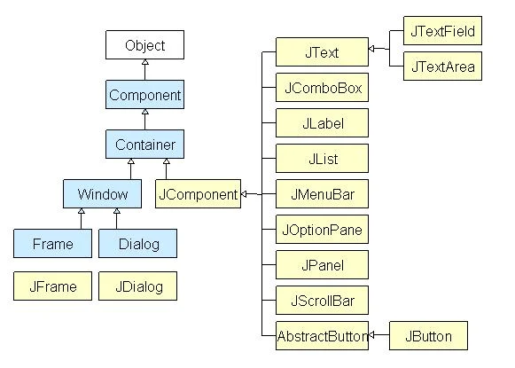
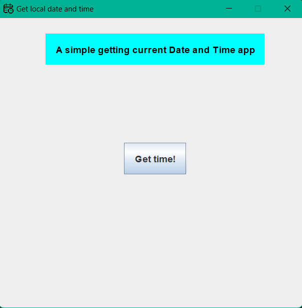
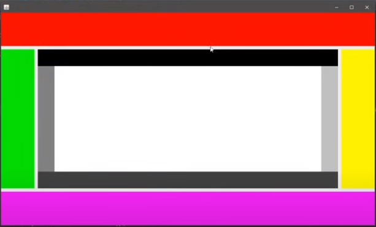
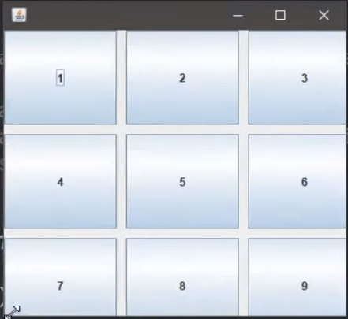

# Java swing

## I. Java swing là gì?

### 1, Java Swing
Swing là một thư viện thuộc các lớp nền tảng của Java (JFC - Java Foundation Classes) library, kế thừa lớp AWT (Abstract Window Toolkit).

Swing cung cấp các container và component đi kèm nhiều thuộc tính để xây dựng các ứng dụng đồ họa (GUI - Graphical User Interface).

Swing hỗ trợ nhiều tính năng hơn so với AWT, nhiều component hơn, nhiều thuộc tính hơn và một số IDE còn cho phép thiết kế với Java Swing chỉ với kéo thả các component (Drag and Drop).

<figure>
    
    <figcaption>Java Swing Class Hierarchy Diagram</figcaption>
</figure>

Dưới đây là một ví dụ về một chương trình đồ họa cơ bản sử dụng Java Swing.

```java
import java.awt.*;
import java.awt.event.*;
import javax.swing.*;
import java.text.DateFormat;
import java.text.SimpleDateFormat;
import java.util.Date;

public class prepareExercise implements ActionListener{
    JFrame frame;
    JButton button;
    JLabel label;

    prepareExercise(){
        frame = new JFrame();
        frame.setTitle("Get local date and time");
        frame.setSize(new Dimension(500, 500));
        frame.setIconImage(new ImageIcon("src\\calendar.png").getImage());
        frame.setDefaultCloseOperation(JFrame.EXIT_ON_CLOSE);
        frame.setResizable(false);

        label = new JLabel();
        label.setHorizontalAlignment(JLabel.CENTER);
        label.setVerticalAlignment(JLabel.CENTER);
        label.setBackground(Color.cyan);
        label.setForeground(Color.black);
        label.setOpaque(true);
        label.setFont(new Font(null, Font.BOLD, 15));
        label.setBounds(75, 25, 350, 50);
        label.setText("A simple getting current Date and Time app");

        button = new JButton();
        button.addActionListener(this);
        button.setText("Get time!");
        button.setFocusable(false);
        button.setFont(new Font(null, Font.BOLD, 15));
        button.setHorizontalTextPosition(JButton.CENTER);
        button.setVerticalTextPosition(JButton.CENTER);
        button.setIconTextGap(15);
        button.setBounds(200, 200, 100, 50);

        frame.setLayout(null);
        frame.add(button);
        frame.add(label);
        frame.setVisible(true);
    }

    @Override
    public void actionPerformed(ActionEvent e){
        if(e.getSource() == button){
            Date date = new Date();
            DateFormat df = new SimpleDateFormat("HH:mm:ss - dd/MM/YYYY");
            label.setText(df.format(date));
        }
    }

    public static void main(String[] args){
        new prepareExercise();
    }
}
```

Sau khi chạy chương trình:



### 2, Container là gì
Container class là những class có thể chứa các `component` bên trong nó.

Để tạo được một ứng dụng Java Swing, ta cần ít nhất một Container.

Có 3 loại Container trong Java Swing:
+ `Frame`: là một cửa sổ với đầy đủ chức năng, có title và icon
+ `Panel`: giống với Frame, Panel cũng có thể chứa các component khác ở bên trong nó nhưng không là một cửa sổ riêng biệt (bản thân nó cũng nằm trong một Frame, một Frame có thể chứa 1 hoặc nhiều Panel)
+ `Dialog`: là một cửa sổ pop-up xuất hiện khi có một thông báo nào đó. Dialog không phải là cửa sổ đầy đủ chức năng như Frame.

### 3, Component là gì?
Component là các lớp abstract cho các điều khiển trên UI. Mỗi component cung cấp chức năng và thể hiện cho một thành phần biểu diễn dữ liệu và tương tác với người dùng.

Java Swing hỗ trợ nhiều loại Component như JLabel, JButton, JCheckBox, JTextField,...

## II. Các Container và Component trong Java Swing
### 1, JFrame
JFrame là lớp thể hiện cho một frame (một chương trình hoàn chỉnh với đầy đủ chức năng).

Import lớp JFrame:
>import javax.swing.JFrame;

#### a, Constructor
+ `JFrame()`
  Tạo một frame mới, ban đầu frame này rỗng và không thể nhìn thấy (invisible).
+ `JFrame(GraphicsConfiguration gc)`
  Tạo một frame trong GraphicsConfiguration của một thiết bị màn hình.
+ `JFrame(String title)`
  Tạo một frame với tiêu đề là title.
+ `JFrame(String title, GraphicsConfiguration gc)`
  Tương tự, tạo một frame trong GraphicsConfiguration với tiêu đề là title.

```java
JFrame frame1 = new JFrame();
JFrame frame2 = new JFrame("This is a Java program");
```

#### b, Setters, getters
+ `setSize(Dimension ds)`
  Đặt kích thước cho một frame, với tham số là một đối tượng thuộc lớp `Dimension` chứa 2 thuộc tính là `width` và `height` chỉ chiều rộng và chiều dài.

```java
frame.setSize(new Dimension(450, 450));
```

+ `setResizable(boolean b)`
  Mặc định có giá trị là `true` hay có thể thay đổi kích thước, ta có thể ngăn thay đổi kích thước cửa sổ bằng câu lệnh:

```java
frame.setResizable(false);
```

+ `setTitle(String title)`
  Ta có thể đặt title cho chương trình hoặc thay đổi title bằng phương thức này.

```java
frame.setTitle("abc");
```

+ `setDefaultCloseOperation()`
  Câu lệnh này quy định hành vi khi bấm dấu X ở phía trên bên phải để đóng chương trình. Mặc định giá trị này là `JFrame.EXIT_ON_ClOSE`, ta có thể thay đổi thành các giá trị khác tùy thuộc vào mục đích.
  + JFrame.EXIT_ON_CLOSE
  + JFrame.HIDE_ON_CLOSE
  + JFrame.DO_NOTHING_ON_CLOSE
  + JFrame.DISPOSE_ON_CLOSE

```java
frame.setDefaultCloseOperation(JFrame.DO_NOTHING_ON_CLOSE);
```

+ `setVisible(boolean b)`
  Mặc định, một đối tượng JFrame sẽ không thể nhìn thấy (invisible), câu lệnh này giúp ta ẩn hiện một frame.
  Để hiển thị một frame:

```java
frame.setVisible(true);
```

+ `setBackground(Color cl)`
  Dùng để thay đổi màu nền của một frame, tương tự như frame thì các component khác cũng có phương thức này tuy nhiên ở frame thì có chút khác biệt.

```java
frame.getContentPane().setBackground(Color.green);
```

#### c, Thay đổi logo
Mặc định, nếu ta không đặt logo cho chương trình thì IDE sẽ tự động đặt một icon có sẵn.

Để thay đổi logo chương trình java swing, ta cần sử dụng phương thức:  
> setIconImage(image.getImage());

Trong đó `image` là một đối tượng thuộc lớp `ImageIcon`. Ta cần tạo một đối tượng image trỏ đến một địa chỉ của ảnh trong bộ nhớ.
> ImageIcon image = new ImageIcon("src\\img.png");

```java
JFrame frame = new JFrame();

ImageIcon image = new ImageIcon("src\\img.png");
frame.setIconImage(image.getImage());
// hoặc
frame.setIconImage(new ImageIcon("src\\img.png").getImage());
```

#### d, Thêm component
Frame là một container có thể chứa các component. Ta có thể dùng lệnh `add` để thêm:
> frame.add(Component cpn);

Ví dụ: Tạo một frame chứa một button
```java
JFrame frame = new JFrame();
JButton button = new JButton();

frame.add(button);
```

#### e, Một số phương thức khác
+ dispose()
+ pack()

### 2, JPanel
JPanel cũng là một container có thể chứa các component khác, tuy nhiên thì JPanel cần phải có một frame chứa nó. JPanel thường được sử dụng để tạo các nhóm component thực hiện cùng chức năng trong một frame.

#### a, Constructor
+ `JFrame()`
+ `JFrame(String title)`

#### b, Các phương thức
+ `setBackgroundColor(Color cl)`
+ `setBounds(x, y, width, height)`
+ `add(Component cpn)`

### 3, JLabel
Lớp JLabel có thể hiển thị text, hoặc hình ảnh, hoặc cả hai. Các nội dung của Label được gán bởi thiết lập căn chỉnh ngang và dọc trong khu vực hiển thị của nó. Theo mặc định, các label được căn chỉnh theo chiều dọc trong khu vực hiển thị. Theo mặc định, text-only label là căn chỉnh theo cạnh, image-only label là căn chỉnh theo chiều ngang.  

#### a, Constructor
+ `JLabel()`
+ `JLabel(Icon image)`
+ `JLabel(Icon image, int horizontalAlignment)`
+ `JLabel(String text)`
+ `JLabel(String text, Icon image, int horizontalAlignment)`
+ `JLabel(String text, int horizontalAlignment)`

#### b, Thay đổi background
```java
JPanel panel = new JPanel();
panel.setBackground(Color.green);
panel.setOpaque(true);
```
Đoạn code phía trên dùng để thay đổi màu nền của một đối tượng panel thuộc lớp JPanel. Cũng giống với các component khác, ta có thể sử dụng phương thức `setBackground()`, tuy nhiên với JPanel ta cần phải sử dụng thêm phương thức `setOpaque(true)` thì lệnh thay đổi background phía trên mới có tác dụng.

#### c, Thay đổi nội dung
+ `setText(String text)`

### 4, JButton
JButton là một lớp để tạo nút nhấn (button). Thành phần này có một label và tạo một sự kiện (event) khi được nhấn, nó cũng có thể có image.

#### a, Constructor
+ `JButton()`
+ `JButton(Action a)`
+ `JButton(Icon icon)`
+ `JButton(String text)`
+ `JButton(String text, Icon icon)`

#### b, Button thực hiện chức năng
Để sử dụng một đối tượng JButton thực hiện một chức năng nào đó, ta cần triển khai interface `ActionListener` trong package `java.awt.event` và override phương thức `actionPerformed(ActionEvent ae)`.

Ta có thể sử dụng phương thức `getSource()` trong awt để biết tương tác của người dùng lên thành phần nào.

```java
import java.awt.*;
import java.awt.event.*;
import javax.swing.*;

public class Label implements ActionListener{
    JButton button;
    JFrame frame;

    Label(){
        frame = new JFrame();
        button = new JButton();

        frame.add(button);
        frame.setVisible(true);
    }
    
    @Override
    public void actionPerformed(ActionEvent e){
        if(e.getSource() == button){
            System.out.println("This button has been pressed!");
        }
    }
}
```

### 5, JTextField
Lớp JTextField là một thành phần cho phép sửa đổi một dòng text đơn.

Một đối tượng thuộc lớp JTextField có thể hiển thị một dòng text, ảnh và cũng có thể nhập dữ liệu text từ bàn phím.

#### a, Constructor
+ `JTextField()`
+ `JTextField(Document doc, String text, int columns)`
+ `JTextField(int columns)`
+ `JTextField(String text)`
+ `JTextField(String text, int columns)`

#### b, Các phương thức khác
+ `setText()`
+ `getText()`

### 6, JTextArea
Lớp JTextArea được sử dụng để tạo một khu vực dành cho text. Nó là một khu vực gồm nhiều dòng và chỉ hiển thị thuần text.

#### a, Constructor

#### b, Các phương thức khác

### 7, JComboBox
Lớp JComboBox là một thành phần mà kết hợp một button, một trường có thể chỉnh sửa và một drop-down list. Tại một thời điểm chỉ có một item có thể được lựa chọn từ list.

#### a, Constructor
+ `JComboBox()`
+ `JComboBox(Object[] items)`
  Tạo một JComboBox chứa các item từ trong mảng đã cho
+ `JComboBox(Vector<?> items)`
  Tạo một JComboBox chứa các phần tử trong vector đã cho

#### b, Các phương thức khác

### 8, JRadioButton
Lớp JRadioButton là một trình triển khai của một radio button, một item mà có thể được lựa chọn hoặc không, và hiển thị trạng thái của nó tới người dùng. Lớp này nên được thêm vào trong ButtonGroup để chỉ lựa chọn một radio button.

#### a, Constructor
+ `JRadioButton()`
+ `JRadioButton(String s)`
  Tạo một unselected radio button với text đã cho
+ `JRadioButton(String s, boolean selected)`
  Tạo một radio button với trạng thái chọn là selected

#### b, Tạo ButtonGroup

#### c, Các phương thức khác

### 9, JProgressBar
Các đối tượng thuộc lớp JProgressBar là một thanh tiến trình, có thể được sử dụng để hiển thị tiến độ, tình trạng hoàn thành của một công việc nào đó.

Trong game, progress bar có thể được sử dụng để hiện thị thanh máu HP, hoặc tiến độ hoàn thành level.

### 10, JSlider

### 11, JList

### 12, JTable

### 13, JMenuBar

## III. Layout trong Java Swing
Layout trong Java Swing là các cách bố trí component trên container được xây dựng sẵn. 

Trong Java Swing có 4 loại layout chính, lập trình viên có thể sử dụng các layout có sẵn này hoặc có thể tự sắp xếp các component tự do theo mong muốn của mình.

### 1, Border Layout
Border layout là cách sắp xếp theo vùng, có 5 vùng là: `NORTH`, `SOUTH`, `CENTER`, `EAST`, `WEST`.



```java
import java.awt.BorderLayout;
import java.awt.Color;
import java.awt.Dimension;
import javax.swing.JPanel;
import javax.swing.JFrame;

public class Main{
	public static void main(String[] args) {

		JFrame frame = new JFrame();
		frame.setDefaultCloseOperation(JFrame.EXIT_ON_CLOSE);
		frame.setSize(500, 500);
		frame.setLayout(new BorderLayout(10,10));
		frame.setVisible(true);

		JPanel panel1 = new JPanel();
		JPanel panel2 = new JPanel();
		JPanel panel3 = new JPanel();
		JPanel panel4 = new JPanel();
		JPanel panel5 = new JPanel();
		
		panel1.setBackground(Color.red);
		panel2.setBackground(Color.green);
		panel3.setBackground(Color.yellow);
		panel4.setBackground(Color.magenta);
		panel5.setBackground(Color.blue);
		
		panel5.setLayout(new BorderLayout());
				
		panel1.setPreferredSize(new Dimension(100,100));
		panel2.setPreferredSize(new Dimension(150,100));
		panel3.setPreferredSize(new Dimension(150,100));
		panel4.setPreferredSize(new Dimension(100,100));
		panel5.setPreferredSize(new Dimension(100,100));
		
		//------------- sub panels --------------------
		
		JPanel panel6 = new JPanel();
		JPanel panel7 = new JPanel();
		JPanel panel8 = new JPanel();
		JPanel panel9 = new JPanel();
		JPanel panel10 = new JPanel();
		
		panel6.setBackground(Color.black);
		panel7.setBackground(Color.darkGray);
		panel8.setBackground(Color.gray);
		panel9.setBackground(Color.lightGray);
		panel10.setBackground(Color.white);
		
		panel5.setLayout(new BorderLayout());
				
		panel6.setPreferredSize(new Dimension(50,50));
		panel7.setPreferredSize(new Dimension(50,50));
		panel8.setPreferredSize(new Dimension(50,50));
		panel9.setPreferredSize(new Dimension(50,50));
		panel10.setPreferredSize(new Dimension(50,50));
	
		panel5.add(panel6,BorderLayout.NORTH);
		panel5.add(panel7,BorderLayout.SOUTH);
		panel5.add(panel8,BorderLayout.WEST);
		panel5.add(panel9,BorderLayout.EAST);
		panel5.add(panel10,BorderLayout.CENTER);
		
		//------------- sub panels --------------------
	
		frame.add(panel1,BorderLayout.NORTH);
		frame.add(panel2,BorderLayout.WEST);
		frame.add(panel3,BorderLayout.EAST);
		frame.add(panel4,BorderLayout.SOUTH);
		frame.add(panel5,BorderLayout.CENTER);
	}
}
```

### 2, Flow Layout
Flow Layout là cách sắp xếp các Component trên một hàng theo thứ tự từ trái sang phải. Các component mặc định cách nhau 5 pixel và cách viền cửa sổ 5 pixel, ta cũng có thể thay đổi các thuộc tính này.

```java
import java.awt.FlowLayout;
import javax.swing.JButton;
import javax.swing.JFrame;

public class Main{

	public static void main(String[] args) {
		JFrame frame = new JFrame();
		frame.setDefaultCloseOperation(JFrame.EXIT_ON_CLOSE);
		frame.setSize(500, 500);
		frame.setLayout(new FlowLayout(FlowLayout.CENTER,0,0));
		
		frame.add(new JButton("1"));
		frame.add(new JButton("2"));
		frame.add(new JButton("3"));
		frame.add(new JButton("4"));
		frame.add(new JButton("5"));
		frame.add(new JButton("6"));
		frame.add(new JButton("7"));
		frame.add(new JButton("8"));
		frame.add(new JButton("9"));
		
		frame.setVisible(true);
	}
}
```

### 3, Grid Layout
Grid Layout sắp xếp các component theo dạng bảng, mỗi ô biểu diễn component đều có kích thước bằng nhau.



```java
import java.awt.GridLayout;
import javax.swing.JButton;
import javax.swing.JFrame;

public class Main{
	public static void main(String[] args) {

		JFrame frame = new JFrame();
		frame.setDefaultCloseOperation(JFrame.EXIT_ON_CLOSE);
		frame.setSize(500, 500);
		frame.setLayout(new GridLayout(3,3,0,0));
		
		frame.add(new JButton("1"));
		frame.add(new JButton("2"));
		frame.add(new JButton("3"));
		frame.add(new JButton("4"));
		frame.add(new JButton("5"));
		frame.add(new JButton("6"));
		frame.add(new JButton("7"));
		frame.add(new JButton("8"));
		frame.add(new JButton("9"));
		
		frame.setVisible(true);
	}
}
```

### 4, Box Layout

### 5, JLayered Pane

## IV. Graphics2D và Images
### 1, Graphics2D


### 2, Images