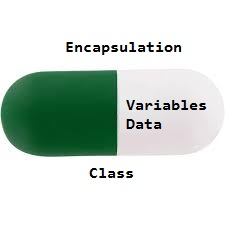
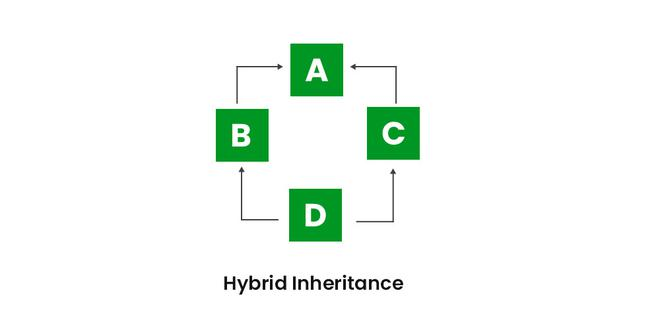
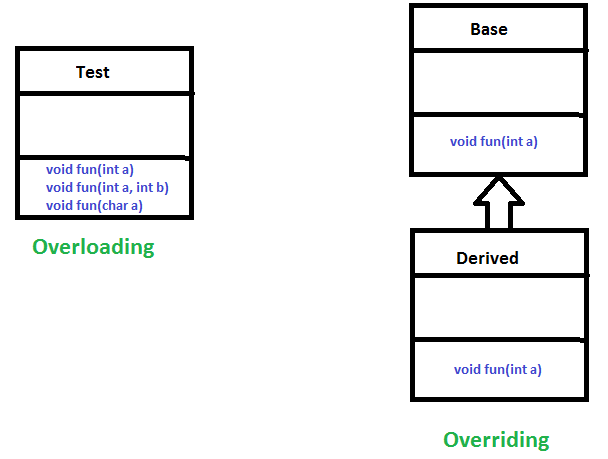

# Mọi thứ đều là đối tượng

- [Mọi thứ đều là đối tượng](#mọi-thứ-đều-là-đối-tượng)
  - [1. Tính đóng gói trong Java](#1-tính-đóng-gói-trong-java)
    - [Lợi ích của tính đóng gói](#lợi-ích-của-tính-đóng-gói)
    - [Nhược điểm của tính đóng gói](#nhược-điểm-của-tính-đóng-gói)
  - [2. Tính kế thừa trong Java](#2-tính-kế-thừa-trong-java)
    - [2.1 Các thuật ngữ cơ bản trong Inheritance](#21-các-thuật-ngữ-cơ-bản-trong-inheritance)
    - [2.2 Tính kế thừa trong Java](#22-tính-kế-thừa-trong-java)
    - [2.3 Các kiểu kế thừa trong Java](#23-các-kiểu-kế-thừa-trong-java)
      - [2.3.1 Kế thừa đơn (single inheritance)](#231-kế-thừa-đơn-single-inheritance)
      - [2.3.2 Kế thừa nhiều cấp (multilevel inheritance)](#232-kế-thừa-nhiều-cấp-multilevel-inheritance)
      - [2.3.3 Kế thừa phân cấp (Hierarchical inheritance)](#233-kế-thừa-phân-cấp-hierarchical-inheritance)
      - [2.3.4 Kế thừa nhiều lớp (mutiple inheritance)](#234-kế-thừa-nhiều-lớp-mutiple-inheritance)
      - [2.3.5 Kế thừa hỗn hợp (Hybrid inheritance)](#235-kế-thừa-hỗn-hợp-hybrid-inheritance)
    - [2.4 Chức năng của kế thừa trong sub class](#24-chức-năng-của-kế-thừa-trong-sub-class)
    - [2.5 Kế thừa phương thức khởi tạo (constructor)](#25-kế-thừa-phương-thức-khởi-tạo-constructor)
  - [3. Tính đa hình trong Java (polymorphism)](#3-tính-đa-hình-trong-java-polymorphism)
    - [3.1 Các loại đa hình trong Java](#31-các-loại-đa-hình-trong-java)
      - [3.1.1 Compile-Time polymorphism](#311-compile-time-polymorphism)
    - [3.2 Runtime Polymorphism in Java](#32-runtime-polymorphism-in-java)

## 1. Tính đóng gói trong Java
Tính đóng gói (Encapsulation) trong Java là một khái niệm cơ bản trong lập trình hướng đối tượng (OOP), là cách giấu đi các thông tin của một class ngăn không cho truy cập từ bên ngoài và chỉ cho phép tương tác với lớp qua các phương thức được cài đặt bên trong class.

Trong Java, ta có thể đảm bảo tính đóng gói trong một class bằng cách thay đổi quyền truy cập (Access modifier) thành private để giới hạn quyền truy cập trong chính class đó.  
Để các phương thức ngoài class truy cập và thay đổi thuộc tính của class thì ta sử dụng các phương thức public gọi là các getter và setter.



Dưới đây là ví dụ về tính đóng gói trong Java
```java
package basic;

class student{
    private String name;
    private int age;
    private double gpa;
    public student(){}
    public student(String name, int age, double gpa) {
        this.name = name;
        this.age = age;
        this.gpa = gpa;
    }
    public String getName() {
        return name;
    }
    public void setName(String name) {
        this.name = name;
    }
    public int getAge() {
        return age;
    }
    public void setAge(int age) {
        this.age = age;
    }
}

public class Basic{
    public static void main(String[] args){
        student Tien = new student();
        student nyTien = new student("abc", 18, 3.7);
        Tien.setName("Tien");
        Tien.setAge(19);
        System.out.println("Name: " + Tien.getName());
        System.out.println("Age: " + Tien.getAge());
    }
}
```
**Output**
>Name: Tien  
Age: 19


### Lợi ích của tính đóng gói
+ **Data Hiding**: giới hạn quyền truy cập dữ liệu bằng cách ẩn đi các thuộc tính. Tính đóng gói đảm bảo dữ liệu về các đối tượng được giấu đi, người dùng sẽ không truy cập được vào những dữ liệu này và thay đổi chúng.
+ **Tăng độ linh hoạt**: ta có thể để các thuộc tính trong class dưới dạng `read only` hoặc `write only` tùy vào nhu cầu. Nếu muốn để kiểu read only thì để các setter và không để getter, ngược lại nếu để write only thì chỉ để getter không để setter.
+ **Khả năng tái sử dụng**
+ **Tự do trong việc triển khai hệ thống**

### Nhược điểm của tính đóng gói
+ Có thể tăng độ phức tạp của chương trình
+ Dài dòng, khó đọc, khó hiểu hơn
+ Giới hạn sự linh hoạt cài đặt

## 2. Tính kế thừa trong Java
Tính kế thừa (Inheritance) là một trong những tính chất quan trọng của OOP. Nó cho phép một class kế thừa những đặc điểm (thuộc tính và phương thức) của một class khác.  
Trong Java, kế thừa nghĩa là tạo một class mới dựa trên một cái đã có sẵn. Class này có thể sử dụng những thuộc tính và phương thức của class cha và cũng có thể thêm các thuộc tính và phương thức riêng.

### 2.1 Các thuật ngữ cơ bản trong Inheritance
+ **Class**: là khuôn mẫu chung cho các đối tượng, chia sẻ cùng thuộc tính và các phương thức. Class không có thực, nó chỉ là một bản vẽ cho các object.
+ **Super class/ Parent class**: là class được kế thừa gọi là class cha.
+ **Sub class/ Child class**: là class kế thừa từ class khác, gọi là class con.
+ **Reusability (Khả năng tái sử dụng)**: khi kế thừa từ một class thì class con được sử dụng những thuộc tính và phương thức đã được tạo từ trước, rút ngắn thời gian và công sức code.
  
### 2.2 Tính kế thừa trong Java

**Syntax**  
```java
class derived-class extends base-class{
    //methods and fields
}
```
**Ví dụ:**
```java
package basic;

class human{
    String name;
    int age;
}

class student extends human{
    int fee;
}

class teacher extends human{
    int salary;
}

public class Basic{
    public static void main(String[] args){
        human  a = new human();
        student b = new student();
        teacher c = new teacher();
    }
}
```
Trong ví dụ trên, khi đối tượng của lớp student và teacher được tạo ra thì nó được kế thừa các thuộc tính từ lớp human là `name` và `age`.

### 2.3 Các kiểu kế thừa trong Java

#### 2.3.1 Kế thừa đơn (single inheritance)
Trong kế thừa đơn, class con kế thừa các thuộc tính từ một class cha.


```java
package basic;

class base_class{
    void printBase(){
        System.out.print("Hello ");
    }
}
class derived_class extends base_class{
    void printDerive(){
        System.out.print("Word");
    }
}
public class Basic{
    public static void main(String[] args){
        derived_class a = new derived_class();
        a.printBase();
        a.printDerive();
    }
}
```
**Output**

>Hello World

#### 2.3.2 Kế thừa nhiều cấp (multilevel inheritance)

Trong kế thừa nhiều cấp, một lớp dẫn xuất được kế thừa từ một lớp cha, lớp dẫn xuất này cũng có thể là lớp cha của các lớp khác.  
Trong Java, một lớp không thể truy cập trực tiếp các thuộc tính của lớp ông (grandparent class).


**Ví dụ**
```java
class One {
    public void print_a()
    {
        System.out.println("One");
    }
}
class Two extends One {
    public void print_b() { 
        System.out.println("Two"); 
    }
}
class Three extends Two {
    public void print_c(){
        System.out.println("Three");
    }
}
public class Main {
    public static void main(String[] args)
    {
        Three g = new Three();
        g.print_a();
        g.print_b();
        g.print_c();
    }
}
```
**Output**
>One  
Two  
Three

#### 2.3.3 Kế thừa phân cấp (Hierarchical inheritance)
Trong kế thừa phân cấp, một class có thể là cha của nhiều class con.


**Ví dụ**
```java
class A {
    public void print_A() { System.out.println("Class A"); }
}
class B extends A {
    public void print_B() { System.out.println("Class B"); }
}
class C extends A {
    public void print_C() { System.out.println("Class C"); }
}
class D extends A {
    public void print_D() { System.out.println("Class D"); }
}
// Driver Class
public class Test {
    public static void main(String[] args)
    {
        B obj_B = new B();
        obj_B.print_A();
        obj_B.print_B();
 
        C obj_C = new C();
        obj_C.print_A();
        obj_C.print_C();
 
        D obj_D = new D();
        obj_D.print_A();
        obj_D.print_D();
    }
}
```
**Output**
>Class A  
Class B  
Class A  
Class C  
Class A  
Class D  

#### 2.3.4 Kế thừa nhiều lớp (mutiple inheritance)

Trong kế thừa nhiều lớp, một lớp có thể kế thừa và sử dụng những phương thức và thuộc tính từ nhiều lớp cha.  
Tuy nhiên trong Java không hỗ trợ mutiple inheritance qua class mà chỉ có thể qua `interface`.

**Ví dụ**
```java
interface One {
    public void print_geek();
}
interface Two {
    public void print_for();
}
interface Three extends One, Two {
    public void print_geek();
}
class Child implements Three {
    @Override public void print_geek()
    {
        System.out.println("Geeks");
    }
    public void print_for() { System.out.println("for"); }
}
// Drived class
public class Main {
    public static void main(String[] args)
    {
        Child c = new Child();
        c.print_geek();
        c.print_for();
        c.print_geek();
    }
}
```
**Output**
>Geeks  
for  
Geeks

#### 2.3.5 Kế thừa hỗn hợp (Hybrid inheritance)

Là sự trộn lẫn giữa hai hay nhiều kiểu kế thừa kể trên. Cũng giống như đa kế thừa, kế thừa hỗn hợp cũng không hỗ trợ class mà chỉ có thể kế thừa qua interface.



### 2.4 Chức năng của kế thừa trong sub class

Trong sub-class ta có thể kế thừa hoặc cũng có thể ghi đè, thay thế, giấu nó đi hoặc bổ sung thêm những phương thức và thuộc tính mới.
+ Các đặc điểm kế thừa có thể sử dụng trực tiếp, giống như các đặc điểm có trong class
+ Có thể khai báo các phương thức, thuộc tính mới không thuộc vào base-class
+ Có thể ghi đè các phương thức của base-class bằng từ khóa `@overriding`
+ Ta có thể viết phương thức tĩnh hoặc thuộc tính trong sub-class có cùng tên với base-class, do đó ẩn đi các phương thức và thuộc tính đó
+ Có thể viết constructor của class con gọi đến constructor của lớp cha

**Ưu điểm của Tính kế thừa**
1. **Tái sử dụng code**: cho phép tái sử dụng những đoạn code đã viết trước đó giúp tiết kiệm lượng code và thời gian
2. **Đảm bảo tính trừu tượng**
3. **Phân cấp class**: giúp mô phỏng mối quan hệ giữa các đối tượng trong thực tế
4. **Đảm bảo tính đa hình**: kế thừa cho phép một đối tượng có thể có nhiều dạng. Subclasses có thể ghi đè phương thức của baseclass, có thể thay đổi hành động theo cách khác

**Nhược điểm**
1. **Phức tạp**: kế thừa có thể khiến code trở nên phức tạp và khó hiểu hơn, đặc biệt là khi sơ đồ phân cấp các đối tượng sâu hơn hoặc là đa kế thừa

### 2.5 Kế thừa phương thức khởi tạo (constructor)
Trong Java, constructor của base class không có tham số sẽ được gọi tự động trong constructor của sub class.

**Ví dụ**
```java
class Base {
    Base(){
        System.out.println("Base Class Constructor Called ");
    }
}
class Derived extends Base {
    Derived(){
        System.out.println("Derived Class Constructor Called ");
    }
}
class main {
    public static void main(String[] args){
        Derived d = new Derived();
    }
}
```

**Output**
>Base Class Constructor Called  
Derived Class Constructor Called 

**Giải thích**
Trong đoạn code trên, constructor của base class sẽ được gọi trước sub class bởi vì lời gọi constructor được thực thi từ trên xuống dưới. Các lệnh trong base class sẽ luôn được thực thi trước sau đó mới đến sub class.

Nếu muốn gọi đến constructor có tham số của base class, ta có thể sử dụng từ khóa `super()`.  
Lưu ý lời gọi đến constructor của base class phải ở dòng đầu tiên trong constructor.

**Ví dụ**

```java
class Base {
    int x;
    Base(int _x) { x = _x; }
}
class Derived extends Base {
    int y;
    Derived(int _x, int _y){
        super(_x);
        y = _y;
    }
    void Display(){
        System.out.println("x = " + x + ", y = " + y);
    }
}
public class main {
    public static void main(String[] args)
    {
        Derived d = new Derived(10, 20);
        d.Display();
    }
}
```
**Output**
>x = 10, y = 20
   
## 3. Tính đa hình trong Java (polymorphism)
Tính đa hình (polymorphism) có nghĩa là có nhiều hình dạng (form).  
Ví dụ về tính đa hình trong thực tế, một người đàn ông có thể cùng là một người cha, người chồng hoặc là một người nhân viên. Cùng một người sở hữu nhiều trạng thái khác nhau trong từng tình huống khác nhau. Được gọi là tính đa hình.

### 3.1 Các loại đa hình trong Java

#### 3.1.1 Compile-Time polymorphism
Còn được gọi là static polymorphism (đa hình tĩnh). Được thể hiện qua function overloading (ghi đè phương thức) và operator overloading (ghi đè toán tử).

>Note: Trong Java không hỗ trợ ghi đè toán tử



**Method Overloading**
Các phương thức có cùng tên gọi nhưng khác
+ Kiểu trả về
+ Kiểu tham số
+ Số lượng tham số

**Ví dụ 1**

```java
class Helper {
    static int Multiply(int a, int b){
        return a * b;
    }
    static double Multiply(double a, double b){
        return a * b;
    }
}
class Main {
    public static void main(String[] args)
    {
        System.out.println(Helper.Multiply(2, 4));
        System.out.println(Helper.Multiply(5.5, 6.3));
    }
}
```
**Output**
>8  
34.65

**Ví dụ 2**
```java
class Helper {
    static int Multiply(int a, int b){
        return a * b;
    }
    static int Multiply(int a, int b, int c){
        return a * b * c;
    }
}
class GFG {
    public static void main(String[] args){
 
        System.out.println(Helper.Multiply(2, 4));
        System.out.println(Helper.Multiply(2, 7, 3));
    }
}
```

**Output**
>8  
42

### 3.2 Runtime Polymorphism in Java
Runtime Polymorphism là quá trình mà một hàm gọi đến một phương thức bị ghi đè được giải quyết tại thời điểm runtime. Tính chất này được thực thi bởi `Method Overriding`. Method overriding xảy ra khi derived class chứa các phương thức có tên giống của base class. Khi đó các phương thức ở base class bị ghi đè (overridden).

**Ví dụ**

```java
class Parent {
    void Print(){
        System.out.println("parent class");
    }
}
class subclass1 extends Parent {
    void Print() { System.out.println("subclass1"); }
}
class subclass2 extends Parent {
    void Print(){
        System.out.println("subclass2");
    }
}

class GFG {

    public static void main(String[] args){
        Parent a;
        a = new subclass1();
        a.Print();

        a = new subclass2();
        a.Print();
    }
}
```

**Output**
>subclass1  
subclass2
