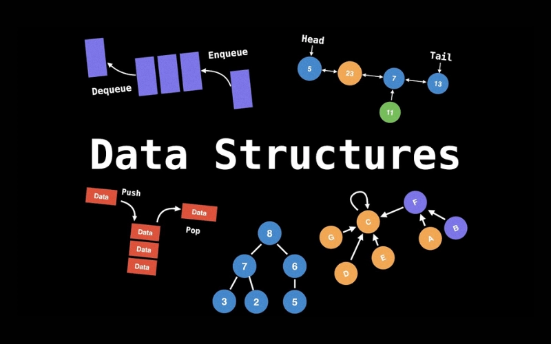
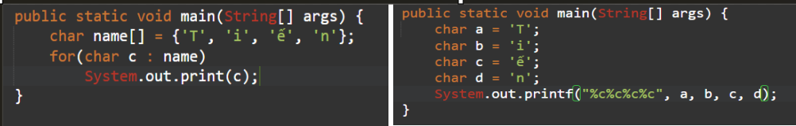
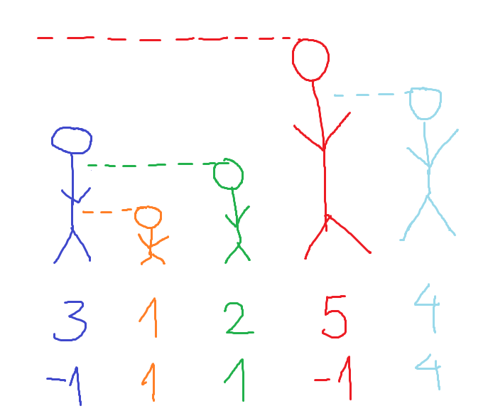
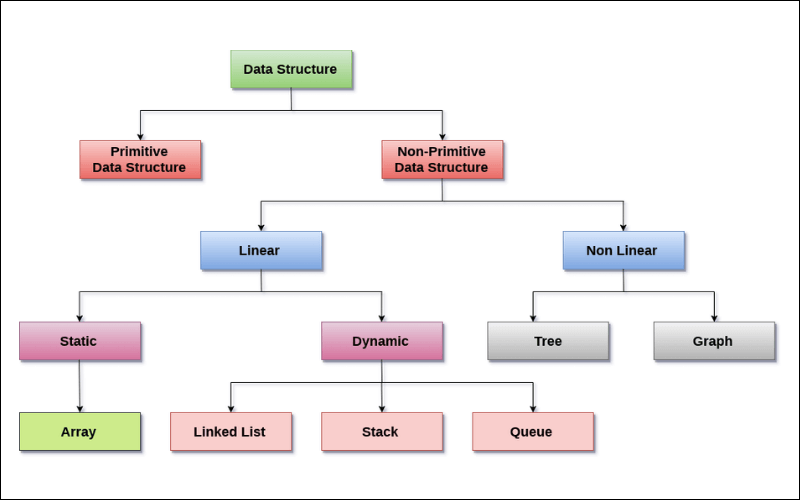
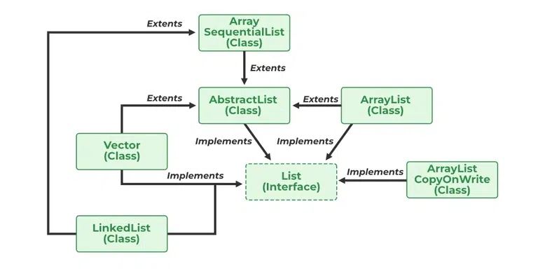

# BUỔI 8: MỘT SỐ CẤU TRÚC DỮ LIỆU TRONG JAVA

- [BUỔI 8: MỘT SỐ CẤU TRÚC DỮ LIỆU TRONG JAVA](#buổi-8-một-số-cấu-trúc-dữ-liệu-trong-java)
  - [I. Cấu trúc dữ liệu là gì?](#i-cấu-trúc-dữ-liệu-là-gì)
    - [Vì sao Cấu trúc dữ liệu lại quan trọng?](#vì-sao-cấu-trúc-dữ-liệu-lại-quan-trọng)
    - [Các đặc tính của Cấu trúc dữ liệu và cách phân loại](#các-đặc-tính-của-cấu-trúc-dữ-liệu-và-cách-phân-loại)
    - [Các loại CTDL phổ biến](#các-loại-ctdl-phổ-biến)
  - [II. Interface Iterable, Collection -\> List, Set, Queue](#ii-interface-iterable-collection---list-set-queue)
    - [Interface Collection](#interface-collection)
      - [Các phương thức cơ bản](#các-phương-thức-cơ-bản)
    - [Iterable interface và iterator interface](#iterable-interface-và-iterator-interface)
    - [Các interface kế thừa collection interface](#các-interface-kế-thừa-collection-interface)
      - [1. List Interface](#1-list-interface)
        - [Array List class](#array-list-class)
        - [Vector class](#vector-class)
        - [Stack class](#stack-class)
        - [LinkedList class](#linkedlist-class)
      - [Queue Interface](#queue-interface)
        - [Priority Queue](#priority-queue)
        - [LinkedList](#linkedlist)
        - [PriorityBlockingQueue](#priorityblockingqueue)
      - [Deque Interface](#deque-interface)
        - [ArrayDeque Class](#arraydeque-class)
      - [Set Interface](#set-interface)
        - [HashSet](#hashset)
        - [TreeSet](#treeset)
        - [LinkedHashSet](#linkedhashset)
        - [EnumSet](#enumset)
  - [III, Interface Map, Sorted Map](#iii-interface-map-sorted-map)
    - [Interface Map](#interface-map)
      - [HashMap](#hashmap)
      - [LinkedHashMap](#linkedhashmap)
    - [Interface SortedMap](#interface-sortedmap)
      - [TreeMap](#treemap)
  - [IV, Cách sử dụng hàm Sort()](#iv-cách-sử-dụng-hàm-sort)
    - [Sử dụng Sort() mặc định](#sử-dụng-sort-mặc-định)
    - [Tùy chỉnh tiêu chí sắp xếp](#tùy-chỉnh-tiêu-chí-sắp-xếp)


## I. Cấu trúc dữ liệu là gì?
  
Cấu trúc dữ liệu (Data structure) là cách sắp xếp và lưu trữ dữ liệu trong máy tính để có thể truy cập và xử lý một cách hiệu quả. Nó định nghĩa cách mà dữ liệu được tổ chức, quan hệ giữa các phần tử dữ liệu và các thao tác có thể thực hiện trên dữ liệu đó.

Mỗi cấu trúc dữ liệu đều có những cách lưu trữ khác nhau dẫn tới sẽ có những phương thức và cách cài đặt riêng biệt, tuy nhiên mọi CTDL đều đáp ứng những chức năng sau:

* **Chèn**: Thêm một phần tử mới vào một vị trí nào đó bên trong CTDL
* **Sửa**: Lập trình viên có thể truy cập vào các phần tử để chỉnh sửa nội dung theo mong muốn
* **Xóa**: Xóa phần tử ra khỏi CTDL
* **Tìm kiếm**: Tìm các phần tử thỏa mãn một số tiêu chí nào đó
* **Sắp xếp**: Sắp xếp các phần tử trong CTDL theo chiều tăng dần/ giảm dần theo một vài tiêu chí

### Vì sao Cấu trúc dữ liệu lại quan trọng?

**1. Giúp dữ liệu trực quan, dễ quản lý, dễ cài đặt**
Mọi ngôn ngữ lập trình hiện nay đều cung cấp cho chúng ta những kiểu dữ liệu để lưu trữ hầu như mọi thông tin trong cuộc sống. Chúng ta có thể liệt kê ra như sau:

* **integer**: dùng để lưu trữ số nguyên
* **big integer**: dùng để lưu trữ những số nguyên có giá trị rất lớn
* **float, double**: dùng để lưu trữ kiểu số thực
* **char**: lưu trữ kiểu kí tự
* **boolean**: lưu trạng thái đúng/ sai
  
Chúng ta có thể sử dụng mỗi biến có 1 kiểu dữ liệu tương ứng để lưu giá trị của một thông tin; với đối tượng có nhiều thông tin, ta sẽ dùng đến số biến tương ứng. Tuy nhiên việc đó sẽ vô cùng rườm rà, khiến cho việc code trở nên phức tạp, khó hiểu hơn, giảm hiệu suất.

**Ví dụ**: Ta muốn lưu trữ tên của một người có tên là `Tiến`, bằng cách sử dụng các kiểu dữ liệu một cách đơn thuần, ta có thể tạo 4 biến kiểu `char` lưu trữ 4 kí tự tương ứng ('T', 'i', 'ế', 'n').  
Nếu tên dài hơn, ta sẽ phải sử dụng nhiều biến hơn và điều đó là rất tệ. Thay vào đó, ta có cấu trúc `array` cho phép lưu một tập hợp biến có cùng kiểu dữ liệu hay cụ thể ở đây là kiểu `char`. Thay vì mỗi biến với một tên khác nhau vừa khó nhớ vừa khó hiểu, ta sử dụng chung một tên cho tất cả và lưu chỉ số đến từng biến tương ứng.



Trường hợp trên chỉ có 4 kí tự, tuy nhiên đối với những dữ liệu lớn hơn, cấu trúc dữ liệu sẽ giúp cho chúng ta quản lý dữ liệu tốt hơn, code dễ triển khai, dễ hiểu, ngắn gọn và tường minh hơn.

**2. Áp dụng đúng CTDL giúp cho việc triển khai hiệu quả, tiết kiệm chi phí**

Chúng ta hãy cùng xem xét bài toán sau:  
Cho một mảng a có n phần tử, mỗi phần tử a[i] là một số nguyên mô tả chiều cao của người đứng thứ i.  
Với mỗi i (1 <= i <= n), hãy tìm vị trí của người đầu tiên ở bên phải cao hơn người đứng ở vị trí i.


[Tham khảo thêm tại đây](https://vnoi.info/wiki/algo/data-structures/Stack.md#b%C3%A0i-to%C3%A1n-1)

Bài này có nhiều cách giải, nhưng ở đây ta sẽ chỉ xét 2 cách:
1. Sử dụng 2 for
2. Sử dụng CTDL stack

Dưới đây là code giải của từng cách sử dụng ngôn ngữ Java  
***Cách 1***
```java
static void solve(int a[], int n){
    for(int i = 1; i <= n; ++i){
        int j = i - 1;
        while(j > 0){
            if(a[j] > a[i]){
                System.out.print(j + " ");
                break;
            }
            j--;
        }
        if(j == 0)
            System.out.print(-1 + " ");
    }
}
```
>ĐPT: O(N^2)

***Cách 2***
```java
static void solve(int a[], int n){
    Stack<Integer> st = new Stack<Integer>();
    for(int i = 1; i <= n; ++i){
        while(!st.empty() && a[st.peek()] <= a[i]){
            st.pop();
        }
        if(st.empty())
            System.out.print(-1 + " ");
        else
            System.out.print(st.peek() + " ");
        st.push(i);
    }
}
```
>ĐPT: O(N)

Bằng cách sử dụng CTDL stack trong bài toán này, ta đã có thể giảm chi phí thời gian rất đáng kể. Vậy nên với mỗi bài toán ta đều phải sử dụng một CTDL phù hợp.

### Các đặc tính của Cấu trúc dữ liệu và cách phân loại

Cấu trúc dữ liệu thường được phân loại theo đặc tính của chúng. Sau đây là ba đặc tính được dùng để phân loại data structure:

* **Tuyến tính** hoặc **phi tuyến tính**  
  Đặc tính này mô tả liệu các mục dữ liệu được sắp xếp theo thứ tự hay không.
* **Đồng nhất** hoặc **không đồng nhất**  
  Đặc tính này mô tả liệu tất cả các mục dữ liệu trong một kho lưu trữ nhất định có cùng loại hay không.
* **Tĩnh** hoặc **động**  
  Đặc tính này mô tả cách các cấu trúc dữ liệu được biên dịch. Data structure tĩnh có kích thước, cấu trúc và vị trí bộ nhớ cố định tại thời điểm biên dịch. Data structure động có kích thước, cấu trúc và vị trí bộ nhớ có thể thu nhỏ hoặc mở rộng, tùy thuộc vào việc sử dụng.


### Các loại CTDL phổ biến
**1. Array**  
**2. Linked list**  
**3. Stack**  
**4. Queue**  
**5. Set**  
**6. Map**  
**7. Tree**  
**8. Heap**  
**9. Graph**  
**10. Trie**  

## II. Interface Iterable, Collection -> List, Set, Queue

### Interface Collection
Cùng với Map Interface, Collection Interface là một root Interface cung cấp nhiều Interface (Set, List, Queue, Deque,...) và các lớp CTDL (ArrayList, Vector, LinkedList,...)  
Interface Collection là thành phần của `java.util`, ta có thể import như sau:
```java
import java.util.Collection; //hoặc
import java.util.*;
```

Collection interface không có các class implement trực tiếp, mà các class này sẽ implement các subinterface của nó.
Các subinterface bao gồm:
* **List**
* **Set**
* **Sorted Set**
* **Queue**
* **Deque**


#### Các phương thức cơ bản

1. Thêm phần tử
* `add(Element e)`: thêm một phần tử có kiểu Element
* `addAll(Collection<?> c)`: thêm tất cả các phần tử trong Collection c
2. Xóa phần tử
* `clear()`: xóa tất cả phần tử
* `remove(Object o)`: xóa 1 phần tử duy nhất có giá trị bằng Object o
* `removeAll(Collection<?> c)`: xóa tất cả phần tử có giá trị tương đồng các phần tử trong c
* `removeIf(Predicate<?> filter)`: xóa có điều kiện
* `retainAll(Collection<?> c)`: giữ lại các phần tử trong c
3. Duyệt
Ta có thể duyệt qua một Collection bằng 3 cách:
* **Cách 1**: Sử dụng phương thức iterator()
```java
import java.util.*;

public class Main {
    public static void main(String[] args) {
        Collection<String> c = new LinkedList<>();
        
        c.add("Nguyễn");
        c.add("Hữu");
        c.add("Tiến");
        c.add("Mã SV: D22BCCN722");
        
        Iterator<String> it = c.iterator();
        while(it.hasNext()){
            System.out.print(it.next() + " ");
        }
    }
}
```

* **Cách 2**: sử dụng for each
```java
import java.util.*;

public class Main {
    public static void main(String[] args) {
        Collection<String> c = new LinkedList<>();
        
        c.add("Nguyễn");
        c.add("Hữu");
        c.add("Tiến");
        c.add("Mã SV: D22BCCN722");
        
        for(Object x : c){
            System.out.print(x.toString() + " ");
        }
    }
}
```

* **Cách 3**: sử dụng phương thức forEach() trong Iterable interface

* **Cách 4**: sử dụng chỉ số để truy cập từng phần tử (nếu CTDL có cung cấp)  
Các CTDL cho phép truy cập thông qua chỉ số bao gồm: array, arrayList, Vector,...

```java
public static void main(String[] args) {
    ArrayList<String> c = new ArrayList<>();
    
    c.add("Nguyễn");
    c.add("Hữu");
    c.add("Tiến");
    c.add("MSV: B22DCCN722");
    
    for(int i = 0; i < c.size(); ++i)
        System.out.print(c.get(i) + " ");
}
```

4. Một số phương thức khác
* `contains(Object o)`: Trả về true nếu trong collection có chứa object o
* `containsAll(Collection<?> c)`: Trả về true nếu trong collection chứa toàn bộ phần tử trong collection tham số
* `equals(Object o)`: So sánh phần tử trong collection với Object o
* `hashCode()`: Trả về hash code của collection
* `isEmpty()`: Trả về true nếu collection rỗng và ngược lại
* `size()`: Trả về kích thước/ số lượng phần tử
* `toArray()`: Chuyển về dạng Array

### Iterable interface và iterator interface

Iterable interface và iterator interface cung cấp những phương thức giúp ta có thể duyệt qua từng phần tử trong một Cấu trúc dữ liệu bất kỳ.

Iterator interface cung cấp những phương thức:
* **hasNext()**: kiểm tra xem có còn phần tử nào phía sau không
* **next()**: di chuyển iterator ra một phần tử kế tiếp
* **remove()**: xóa phần tử ra khỏi collection

Xem ví dụ dưới đây để hiểu rõ hơn về cách khai báo iterator và sử dụng các phương thức của nó
```java
public static void main(String[] args) {
    ArrayList<String> c = new ArrayList<>();
      
        c.add("A");
        c.add("B");
        c.add("Nguyễn");
        c.add("Hữu");
        c.add("Tiến");
        c.add("MSV: B22DCCN722");
        
        Iterator<String> it = c.iterator();
        while(it.hasNext()){
            if(it.next().equals("Tiến"))
            it.remove();
            // ở đây chưa biết cách dùng remove()
            System.out.print(it.next() + " ");
        }
        System.out.println(c.size());
    }
```
**Output**
>B Hữu MSV: B22DCCN722 5

**Cách triển khai Iterable interface**

1. Triển khai Iterable interface với các phương thức của CTDL tương ứng
2. Tạo một iterator class triển khai Iterator interface

Mã giả:
```java
class CustomDataStructure implements Iterable<> {  
    // code for data structure 
    public Iterator<> iterator() { 
        return new CustomIterator<>(this); 
    } 
} 

class CustomIterator<> implements Iterator<> {       
    // constructor 
    CustomIterator<>(CustomDataStructure obj) { 
        // initialize cursor 
    } 
    // Checks if the next element exists 
    public boolean hasNext() { 
    } 
    // moves the cursor/iterator to next element 
    public T next() { 
    } 
    // Used to remove an element. Implement only if needed 
    public void remove() { 
        // Default throws UnsupportedOperationException. 
    } 
} 
```
>Iterator class cũng có thể được tạo bên trong khai báo CTDL

[Tham khảo code tạo lớp Linked list](https://ideone.com/piueCx)

### Các interface kế thừa collection interface

#### 1. List Interface
Lưu trữ các phần tử dưới dạng một danh sách tuyến tính, một số Class cho phép truy cập phần tử thông qua chỉ số.

##### Array List class 
Array List là mảng động trong Java, nó chậm hơn so với array tĩnh tuy nhiên sẽ hữu hiệu hơn trong nhiều trường hợp và cung cấp nhiều phương thức hơn.
```java
import java.io.*;
import java.util.*;
 
class GFG {
    public static void main(String[] args)
    {
        // Size of ArrayList
        int n = 5;
 
        // Declaring the List with initial size n
        List<Integer> arrli = new ArrayList<Integer>(n);
 
        // Appending the new elements
        // at the end of the list
        for (int i = 1; i <= n; i++)
            arrli.add(i);
 
        // Printing elements
        System.out.println(arrli);
 
        // Remove element at index 3
        arrli.remove(3);
 
        // Displaying the list after deletion
        System.out.println(arrli);
 
        // Printing elements one by one
        for (int i = 0; i < arrli.size(); i++)
            System.out.print(arrli.get(i) + " ");
    }
}
```
**Output**
>[1, 2, 3, 4, 5]
>[1, 2, 3, 5]
>1 2 3 5

##### Vector class  
Vector là dynamic array cho phép tăng kích cỡ trong quá trình chạy chương trình. Các phần tử trong vector cũng có thể truy xuất qua chỉ số.
```java
import java.io.*;
import java.util.*;
 
class GFG {
    public static void main(String[] args)
    {
        // Size of the vector
        int n = 5;
 
        // Declaring the List with initial size n
        List<Integer> v = new Vector<Integer>(n);
 
        // Appending the new elements
        // at the end of the list
        for (int i = 1; i <= n; i++)
            v.add(i);
 
        // Printing elements
        System.out.println(v);
 
        // Remove element at index 3
        v.remove(3);
 
        // Displaying the list after deletion
        System.out.println(v);
 
        // Printing elements one by one
        for (int i = 0; i < v.size(); i++)
            System.out.print(v.get(i) + " ");
    }
}
```
**Output**
>[1, 2, 3, 4, 5]
>[1, 2, 3, 5]
>1 2 3 5 

##### Stack class  
Stack là cấu trúc dữ liệu trong đó việc truy xuất các phần tử dựa trên quy tắc LIFO(last in first out - vào sau ra trước). Các phương thức của stack:
* `add(Object o)`: thêm phần tử
* `pop()`: xóa phần tử ở đầu stack
* `peek()`: trả về phần tử ở đầu stack (thêm vào cuối cùng)
* `size()`: kích thước
* `isEmpty()`: kiểm tra rỗng
* `search(Object o)`: tìm kiếm Object o

```java
import java.io.*;
import java.util.*;
 
class GFG {
    public static void main(String[] args)
    {
        // Size of the stack
        int n = 5;
 
        // Declaring the List
        List<Integer> s = new Stack<Integer>();
 
        // Appending the new elements
        // at the end of the list
        for (int i = 1; i <= n; i++)
            s.add(i);
 
        // Printing elements
        System.out.println(s);
 
        // Remove element at index 3
        s.remove(3);
 
        // Displaying the list after deletion
        System.out.println(s);
 
        // Printing elements one by one
        for (int i = 0; i < s.size(); i++)
            System.out.print(s.get(i) + " ");
    }
}
```
**Output**
>[1, 2, 3, 4, 5]
>[1, 2, 3, 5]
>1 2 3 5 

##### LinkedList class  
Biểu diễn cấu trúc dữ liệu Linked List. Trong Linked List, các phần tử không được lưu trên các ô nhớ liên tiếp mà ở những vị trí bất kỳ, mỗi phần tử sẽ lưu địa chỉ đến phần tử kế tiếp hoặc phía trước của nó.  
Iterator của LinkedList có thể truy cập đến các phần tử ở phía trước nó (khác với hầu hết CTDL chỉ có thể truy cập về phía trước).
* `hasPrevious()`: true nếu có phần tử ở trước
* `previous()`: trỏ đến phần tử ở trước
* `next()`
* `hasNext()`
* `nextIndex()`: trả về iterator trỏ đến phần tử kế tiếp
* `previousIndex()`: trả về iterator trỏ đến phần tử trước
```java
import java.io.*;
import java.util.*;
 
class GFG {
    public static void main(String[] args)
    {
        // Size of the LinkedList
        int n = 5;
 
        // Declaring the List with initial size n
        List<Integer> ll = new LinkedList<Integer>();
 
        // Appending the new elements
        // at the end of the list
        for (int i = 1; i <= n; i++)
            ll.add(i);
 
        // Printing elements
        System.out.println(ll);
 
        // Remove element at index 3
        ll.remove(3);
 
        // Displaying the list after deletion
        System.out.println(ll);
 
        // Printing elements one by one
        for (int i = 0; i < ll.size(); i++)
            System.out.print(ll.get(i) + " ");
    }
}
```
**Output**
>[1, 2, 3, 4, 5]
>[1, 2, 3, 5]
>1 2 3 5 
  
#### Queue Interface  
Lưu trữ các phần tử trong tập hợp với quy tắc LIFO (last in first out - vào sau ra trước). Ta chỉ có thể chèn phần tử vào cuối và xóa phần tử ở đầu queue.
  
Các class triển khai Queue Interface:
##### Priority Queue
Priority Queue là một dạng cấu trúc min heap hoặc max heap, trong đó phần tử đầu tiên sẽ là phần tử lớn nhất và cuối cùng sẽ là nhỏ nhất (theo tiêu chí so sánh).  
Các phương thức:
* `add(Object o)`: thêm phần tử
* `peek()`: trả về phần tử đầu queue
* `poll()`: trả về phần tử đầu và xóa ra khỏi queue
* `remove(Object o)`: xóa phần tử
```java
import java.util.*;
 
class GfG {
 
    public static void main(String args[])
    {
        // Creating empty priority queue
        Queue<Integer> pQueue
            = new PriorityQueue<Integer>();
 
        // Adding items to the pQueue
        // using add()
        pQueue.add(10);
        pQueue.add(20);
        pQueue.add(15);
 
        // Printing the top element of
        // the PriorityQueue
        System.out.println(pQueue.peek());
 
        // Printing the top element and removing it
        // from the PriorityQueue container
        System.out.println(pQueue.poll());
 
        // Printing the top element again
        System.out.println(pQueue.peek());
    }
}
```
**Output**
>10
>10
>15

##### LinkedList
##### PriorityBlockingQueue

#### Deque Interface
Deque hay double-ended queue (hàng đợi hai đầu) là một cấu trúc dữ liệu cho phép thêm, xóa phần tử ở cả hai đầu.  
Các phương thức:
  * `add(Object o)`: thêm phần tử mới vào cuối
  * `addFirst(Object o)`
  * `addLast(Object o)`
  * `getFirst()`
  * `getLast()`
  * `offer(Object o)`
  * `peek()`
  * `peekFirst()`
  * `peekLast()`
  * ...

##### ArrayDeque Class
```java
import java.util.*;
public class ArrayDequeDemo {
    public static void main(String[] args)
    {
        // Initializing an deque
        Deque<Integer> de_que
            = new ArrayDeque<Integer>(10);
 
        // add() method to insert
        de_que.add(10);
        de_que.add(20);
        de_que.add(30);
        de_que.add(40);
        de_que.add(50);
 
        System.out.println(de_que);
 
        // clear() method
        de_que.clear();
 
        // addFirst() method to insert the
        // elements at the head
        de_que.addFirst(564);
        de_que.addFirst(291);
 
        // addLast() method to insert the
        // elements at the tail
        de_que.addLast(24);
        de_que.addLast(14);
 
        System.out.println(de_que);
    }
}
```
**Output**
>[10, 20, 30, 40, 50]
>[291, 564, 24, 14]

#### Set Interface
Lưu các phần tử riêng biệt, nếu 2 phần tử có giá trị trùng nhau, Set sẽ chỉ lưu một phần tử mang giá trị đấy.
  
Các Class triển khai Set Interface:
##### HashSet 
Lưu trữ các phần tử trong bảng băm, nhưng không đảm bảo thứ tự thêm vào
```java
public static void main(String[] args) 
{ 
    // Creating object of Set of type String 
    Set<String> h = new HashSet<String>(); 

    // Adding elements into the HashSet 
    // using add() method 

    // Custom input elements 
    h.add("India"); 
    h.add("Australia"); 
    h.add("South Africa"); 

    // Adding the duplicate element 
    h.add("India"); 

    // Displaying the HashSet 
    System.out.println(h); 

    // Removing items from HashSet 
    // using remove() method 
    h.remove("Australia"); 
    System.out.println("Set after removing "
                        + "Australia:" + h); 

    // Iterating over hash set items 
    System.out.println("Iterating over set:"); 

    // Iterating through iterators 
    Iterator<String> i = h.iterator(); 

    // It holds true till there is a single element 
    // remaining in the object 
    while (i.hasNext()) 

        System.out.println(i.next()); 
} 
```
**Output**
>[South Africa, Australia, India]
>Set after removing Australia:[South Africa, India]
>Iterating over set:
>South Africa
>India  

##### TreeSet
Lưu các phần tử dưới dạng cây, được sắp xếp.
##### LinkedHashSet
Lưu dưới dạng bảng băm và theo danh sách liên kết, đảm bảo thứ tự thêm vào.
##### EnumSet
Set dành cho kiểu Enum.

## III, Interface Map, Sorted Map

### Interface Map
Các lớp triển khai Map Interface lưu dữ liệu theo từng cặp {key, value}. Mỗi cặp này được gọi là một entry.

Các tính chất của Map:
* Các key trong Map là riêng biệt, không có 2 phần tử nào có cùng key
* Truy cập các entry thông qua key của nó
* Kích thước mặc định là 2^4 = 16 phần tử, tự động tăng lên gấp đôi nếu không đủ

Các class triển khai:

#### HashMap
Không đảm bảo thứ tự thêm vào.
```java
public static void main(String[] args) 
{ 
    // Creating an empty HashMap 
    Map<String, Integer> map = new HashMap<>(); 

    // Inserting entries in the Map 
    // using put() method 
    map.put("vishal", 10); 
    map.put("sachin", 30); 
    map.put("vaibhav", 20); 

    // Iterating over Map 
    for (Map.Entry<String, Integer> e : map.entrySet()) 

        // Printing key-value pairs 
        System.out.println(e.getKey() + " "
                            + e.getValue()); 
} 
```
**Output**
>vaibhav 20
>vishal 10
>sachin 30

#### LinkedHashMap
Kế thừa HashMap, LinkedHashMap có các tính chất và phương thức tương tự, tuy nhiên đã được cải tiến để đảm bảo thứ tự thêm vào.
```java
public static void main(String[] args) 
{ 

    // Creating an empty LinkedHashMap 
    Map<String, Integer> map = new LinkedHashMap<>(); 

    // Inserting pair entries in above Map 
    // using put() method 
    map.put("vishal", 10); 
    map.put("sachin", 30); 
    map.put("vaibhav", 20); 

    // Iterating over Map 
    for (Map.Entry<String, Integer> e : map.entrySet()) 

        // Printing key-value pairs 
        System.out.println(e.getKey() + " "
                            + e.getValue()); 
}
```
**Output**
>vaibhav 20
>vishal 10
>sachin 30

### Interface SortedMap

Kế thừa Interface Map, nhưng bổ sung thêm có thể thay đổi thứ tự sắp xếp các entry.

#### TreeMap
   Duy trì thứ tự entry dựa trên một comparator (mặc định sắp xếp tăng dần).

```java
public static void main(String[] args) 
{ 

    // Creating an empty TreeMap 
    Map<String, Integer> map = new TreeMap<>(); 

    // Inserting custom elements in the Map 
    // using put() method 
    map.put("vishal", 10); 
    map.put("sachin", 30); 
    map.put("vaibhav", 20); 

    // Iterating over Map using for each loop 
    for (Map.Entry<String, Integer> e : map.entrySet()) 

        // Printing key-value pairs 
        System.out.println(e.getKey() + " "
                            + e.getValue()); 
} 
```
**Output**
>sachin 30
vaibhav 20
vishal 10

## IV, Cách sử dụng hàm Sort()

### Sử dụng Sort() mặc định
Các class triển khai Collection Interface có hàm sort sắp xếp theo tiêu chí mặc định tăng dần.  
Ta có thể dễ dàng gọi đến bằng lệnh:
>Collections.sort(<Collection>);
```java
public static void main(String[] args)
{
    ArrayList<String> al = new ArrayList<>();
    al.add("b");
    al.add("a");
    al.add("e");
    al.add("c");
    
    Collections.sort(al);
    System.out.println(al);
}
```
**Output**
>[a, b, c, d]

### Tùy chỉnh tiêu chí sắp xếp
Ta có thể thay đổi trình tự sắp xếp các phần tử khi gọi hàm sort bằng `Comparable Interface` và phương thức `compareTo()`.  
Xem ví dụ dưới đây để hiễu rõ hơn.
```java
class abc implements Comparable<abc>{
  int num;
  
  public abc(){}
  public abc(int num){
    this.num = num;
  }
  
  public String toString(){
    return Integer.toString(num);
  }
  
  public int compareTo(abc b){
    return b.num - this.num;
  }
}
 
class GFG {
    public static void main(String[] args)
    {
        ArrayList<abc> al = new ArrayList<>();
        al.add(new abc(4));
        al.add(new abc(2));
        al.add(new abc(3));
        al.add(new abc(1));
        
        Collections.sort(al);
        System.out.println(al);
    }
}
```
